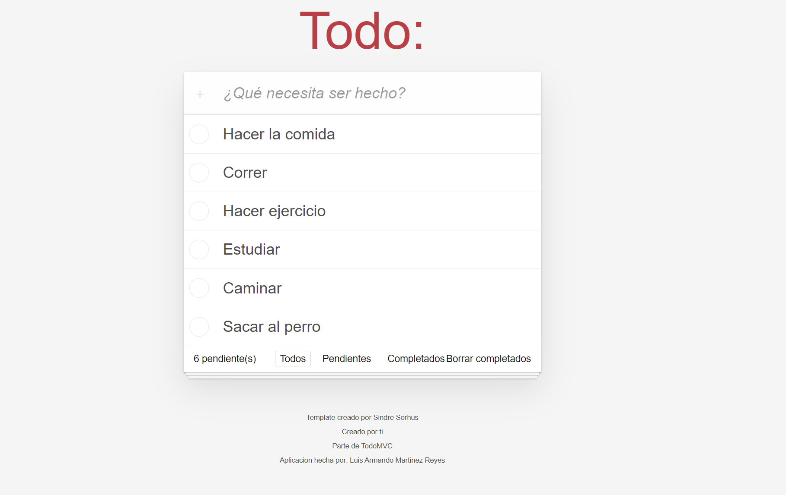
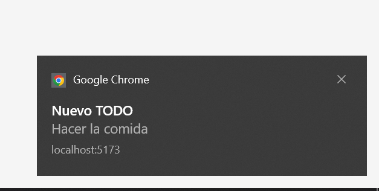
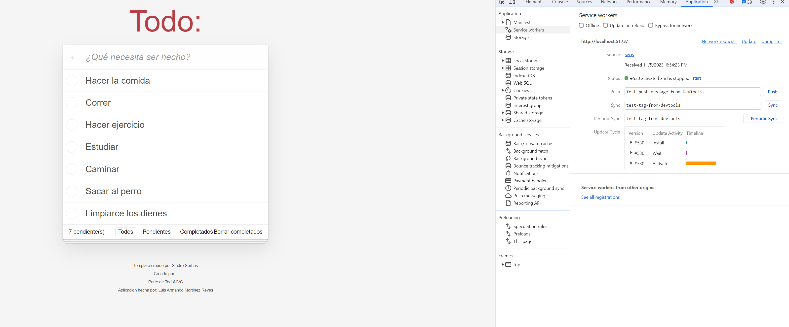

## Autor
Luis Armando Martinez Reyes

## TODO PWA
Esta es una Progresive Web App (PWA) simple para agregar y administrar tareas que se puedan hacer en el dia a dia

## Caracteristicas
- Guarda la tarea indicada
- Filtra entre tareas realizadas y no realizadas
- Borra tareas ya completadas

## Uso
1. Clona este repositorio 
2. Corre el comando npm i
3. Corre el comando npm run dev
4. Abre el link que te indique tu local

## Tecnologias Utilizadas
- HTML
- CSS
- JS
- VITE

## Demostración
Splash Screen

Agregar tarea

Notificacion

Service Worker DevTools
